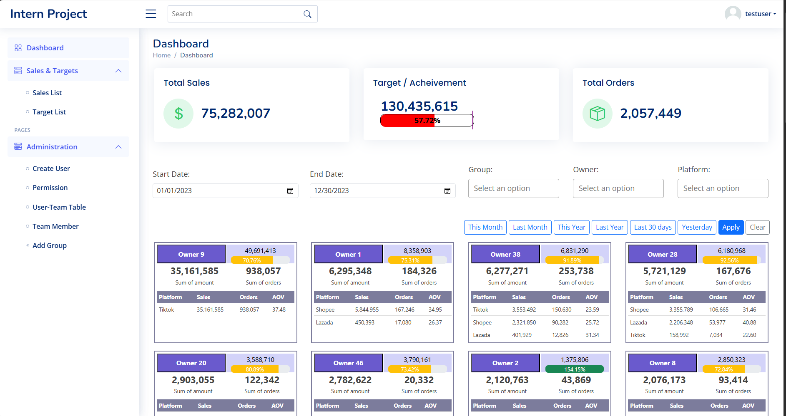
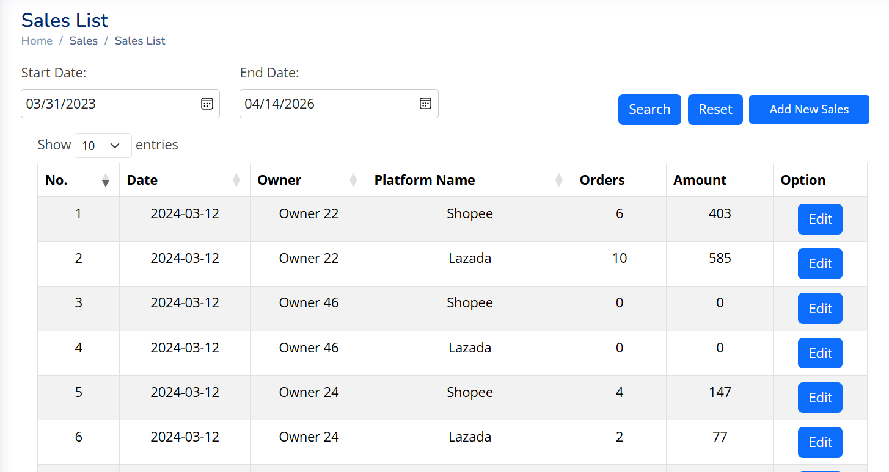
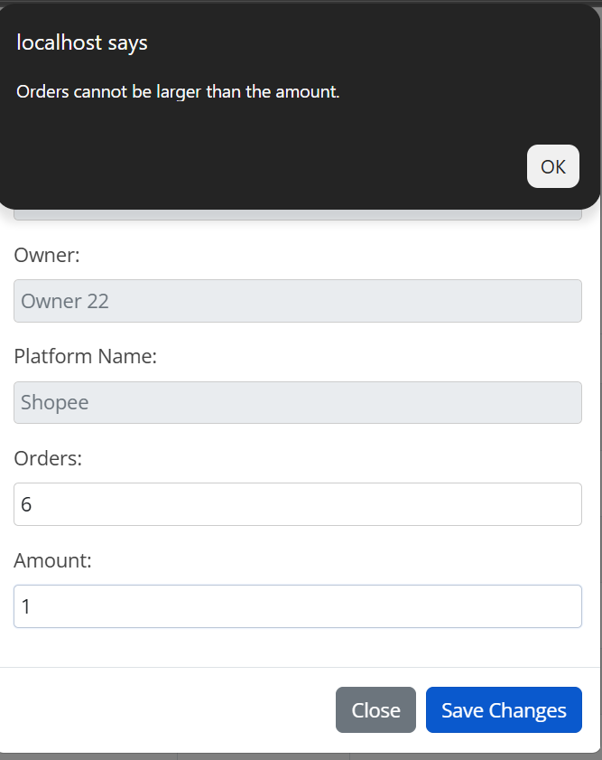
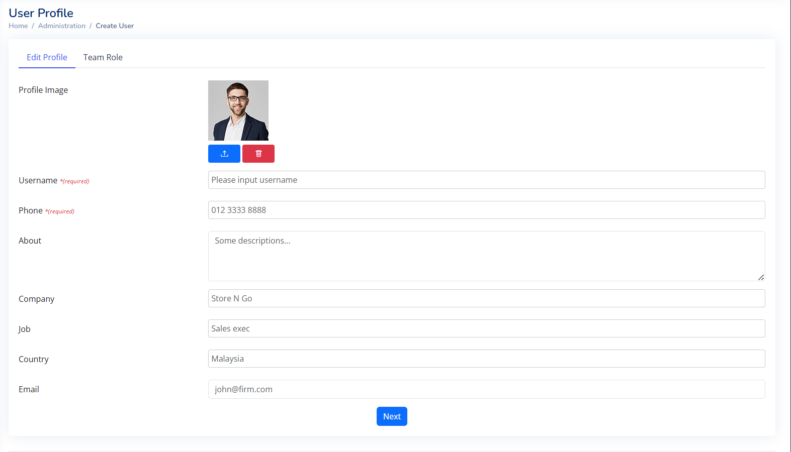
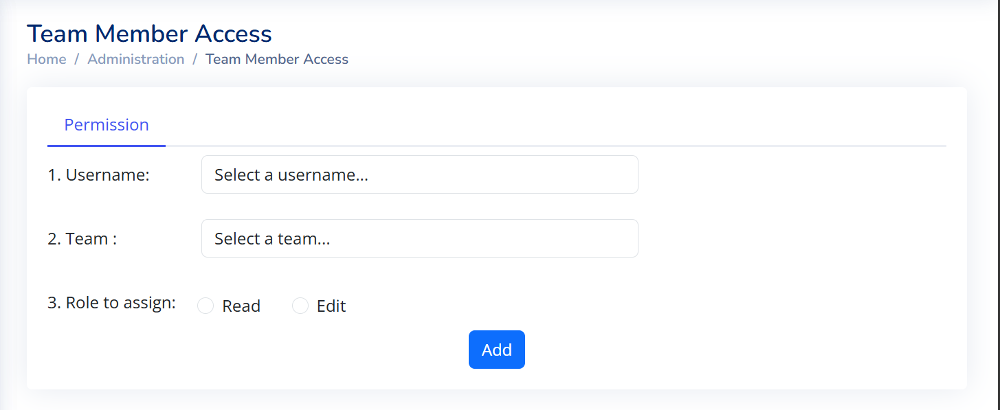
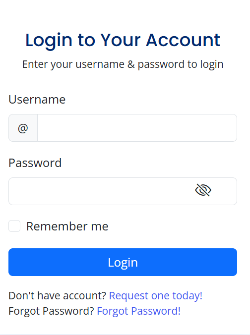
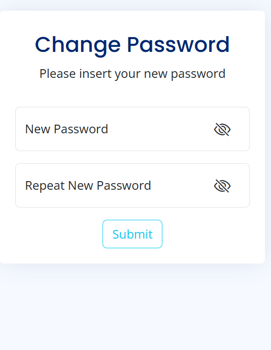

# Sales-Management-System

## Project Overview 

*Note: Due to confidentiality agreements, full source code is not publicly available.*

This project showcases the backend system I developed during my internship, designed to streamline sales performance monitoring. It provides management with insights through multi-filter analytics (owner, platform, date range). The system prioritizes data accuracy with validation access for sales entries and ensures secure operations via a role-based access control system and a WhatsApp OTP flow for password recovery and user setup.

## Key Features & Functionalities

This system provides a comprehensive suite of features:

   **Real-time Sales Dashboard:** Management gains immediate insights into key sales metrics (sum of sales, orders, AOV) across configurable timeframes (daily, monthly, quarterly, yearly).
   
   **Sales & Target Recording:** Employees can accurately record sales figures and targets, supported by robust input validation and access control to ensure data integrity and authorized data entry.
   
   **Advanced Data Viewing & Management:** Users can track sales and targets with flexible filtering (date range, multiple owners/platforms), quick search, and efficient in-line editing capabilities. Data is presented with pagination and customizable display options.
   
   **Organizational Management:** Streamlined administration for creating and managing groups and owners, defining the structure of sales territories or business units.
   
   **User Administration & Permissions:** Administrators can create new user accounts, set up profiles (username, phone number), and assign specific owner access through an intuitive group and team-based workflow.
   
   **Enhanced Security:** Implemented secure One-Time Password (OTP) process via WhatsApp API for first-time logins and password resets.

## Screenshots

  *(Screenshots below use dummy data for demonstration purposes.)*

### Sales Dashboard Overview

  

 <em>Illustrates the interface for management to monitor the sales performance against target</em>

### Sales Data Table with Filters

  

<em>Illustrates the interface to see the sales data keyed</em>

### Sales Data Entry Form

  

<em>Illustrates the interface for employees to record sales data, including validation prompts.</em>

### User Administration & Permissions

  

  

<em>Demonstrates the process for administrators to create users and assign owner access.</em>

### OTP Flow

  

    
    
Step 1: Choose Forgot Password

  

  

    
    
Step 2: Enter Username & Phone Number

  

  

    
    
Step 3: Enter OTP

  

  

    
    
Step 4: Set New Password

  

<em>Demonstrates the process to reset password and setup new user, including validation prompts.</em>

## Technical Stack

   **Server-Side Language:** PHP
   
   **Database:** MySQL
   
   **API Style:** REST API
   
   **Client-Side:** JavaScript, HTML, CSS

## My Contributions

*   Developed backend API endpoints for data processing and management.
*   Wrote and optimized SQL queries for efficient data retrieval and updates.
*   Implemented robust input validation and access control logic.
*   Integrated with external services (WhatsApp API for OTP).
*   Contributed to backend system design and performance improvements.
